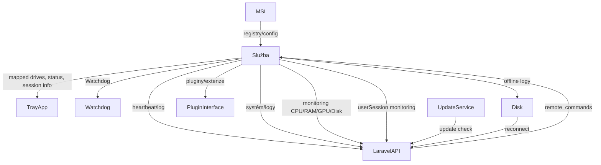

# Patron Monitoring Agent

## Pøehled

Endpoint Management Software (EMS) je profesionální klientská aplikace pro správu a monitoring koncových bodù (PC/serverù) ve firemním prostøedí s podporou více klientù, bezpeènou autentizací, vzdálenými pøíkazy a auto-updatem. Správa probíhá pøes API na Laravel serveru (PHP).

---

## Hlavní funkce

- **Ovládání pøes Laravel API** (Bearer token, JSON)
- **Podpora více klientù** (UUID, validace serverem)
- **Serilog s JSON logy, event log**
- **ID a log TeamVieweru (rozšiøitelné)**
- **IoC, interface-driven design, DI kontejner**
- **Konfigurace v registrech (AES šifrovaný token, interval)**
- **Retry logika pro API**
- **Watchdog služba (hlídání agenta i tray aplikace)**
- **Remote commands (restart, vypnutí, exec, update)**
- **Detekce a hlášení vypnutí/restartu stanice**
- **Auto-update**
- **Monitoring mapped network drives (uživatelská session)**
- **MSI instalátor**
- **Unit testy (NUnit)**
- **Tray aplikace (stav, ruèní restart, heartbeat pro watchdog)**
- **Strukturované logy, monitoring, serializované logy (JSON)**
- **Systémový monitoring: CPU, GPU, RAM, disky, systémové logy**
- **Monitoring user session: uživatel, èas, mapped drives, pøístupné cesty**
- **API Rate-limit handling**
- **Extensibility (plugin architektura)**
- **Bezpeènostní review**
- **Disaster recovery**

---

## Architektura

- **Program.cs** – Start, DI kontejner
- **Interfaces** – IApiClient, IConfigurationProvider, ILoggerService, IRemoteCommandHandler, IUpdateService, IDriveMonitor, IWatchdog, ISystemMonitor, ISessionMonitor
- **Services** – ApiClient, RegistryConfigurationProvider, SerilogLogger, RemoteCommandHandler, UpdateService, DriveMonitor, WatchdogService, SystemMonitor, SessionMonitor
- **PluginInterface** – rozšíøení monitoring/remote funkcí
- **TrayApp** – Windows Forms/WPF tray aplikace
- **Unit Tests** – NUnit projekt

---

## Konfigurace a registrace

- **Token (AES šifrovaný):** `HKLM\Software\Company\EMS\Token`
- **Interval:** `HKLM\Software\Company\EMS\Interval`
- **UUID klienta:** `HKLM\Software\Company\EMS\UUID`

---

## API SPECIFIKACE

### Autentizace

- Všechny endpointy vyžadují Bearer token (`Authorization: Bearer ...`).

---

### 1. Registrace/Validace klienta

```
POST /api/clients/register
Content-Type: application/json
Authorization: Bearer {token}

{
  "uuid": "<UUID>",
  "hostname": "<PC-NAME>",
  "system": {
    "os": "Windows 11 Pro",
    "cpu": "Intel Core i7-13700K",
    "ram": "32GB",
    "gpu": "NVIDIA RTX 4070",
    "disks": [
      {"name":"C:", "size":"1TB", "free":"600GB", "type":"SSD"}
    ]
  }
}
```

**Odpovìï:**
```json
{
  "status": "ok",
  "interval": 60,
  "token": "..........",
  "update_url": null
}
```

---

### 2. Heartbeat

```
POST /api/clients/{uuid}/heartbeat
Content-Type: application/json
Authorization: Bearer {token}

{
  "status": "online",
  "last_error": "",
  "drives": [
    { "letter": "Z:", "path": "\\\\server\\data" }
  ],
  "system_monitor": {
    "cpu_usage": 14.3,
    "ram_usage": 53.2,
    "gpu_usage": 12.1,
    "disks": [
      {"name":"C:", "free":"600GB", "usage": 40.1}
    ]
  },
  "session_monitor": {
    "user": "jnovak",
    "session_start": "2025-05-23T06:30:00Z",
    "mapped_drives": [
      {"letter":"Z:","path":"\\\\server\\data"}
    ],
    "accessible_paths": [
      "C:\\Users\\jnovak\\Documents",
      "Z:\\"
    ]
  }
}
```

**Odpovìï:**
```json
{
  "status": "ok",
  "remote_commands": [],
  "update_url": null
}
```

---

### 3. Log upload

```
POST /api/clients/{uuid}/log
Content-Type: application/json
Authorization: Bearer {token}

{
  "log": "<json-log-blob>",
  "system_logs": [
    {"source":"System","entryType":"Error","time":"2025-05-23T06:00:00Z","message":"Disk error..."}
  ]
}
```

**Odpovìï:**
```json
{
  "status": "ok"
}
```

---

### 4. Remote commands

- Remote commands jsou vráceny v odpovìdi serveru v poli `remote_commands`:

```json
{
  "remote_commands": [
    { "type": "restart" },
    { "type": "shutdown" },
    { "type": "exec", "command": "ipconfig /all" },
    { "type": "update", "url": "https://..." }
  ]
}
```

---

### 5. Hlášení vypnutí/restartu stanice

Pøi vypnutí nebo restartu poèítaèe agent služba odešle na server informaci o události:

```
POST /api/clients/{uuid}/shutdown
Content-Type: application/json
Authorization: Bearer {token}

{
  "type": "system_shutdown",    // nebo "system_restart", "service_stop"
  "time": "2025-05-24T15:49:00Z",
  "user": "ONyklicek",
  "hostname": "DESKTOP-123"
}
```

**Odpovìï:**
```json
{
  "status": "ok"
}
```

Poznámka: Typ události (`type`) mùže být napø. `"system_shutdown"`, `"system_restart"` nebo `"service_stop"` dle zjištìného dùvodu.

---

### 6. API Rate-limit handling

- Pokud API vrátí HTTP 429 (Too Many Requests), klient:
  - Respektuje hlavièku `Retry-After` (pokud je pøítomna).
  - Pokud chybí, použije exponenciální back-off.
  - Události o rate-limitu loguje vèetnì endpointu, èasu, do Serilog logu.
- Pokud je pøekroèen limit opakovanì, klient automaticky zvýší interval heartbeat a log uploadù dle konfigurace serveru nebo pøednastavených pravidel.

---

### 7. Disaster recovery

- Pokud není server dostupný:
  - Klient data (logy, monitoring) ukládá lokálnì (do šifrovaného souboru).
  - Po obnovení spojení dojde k dávkovému uploadu.
  - Kritické incidenty (napø. restart watchdogem) jsou nahlášeny po obnovì spojení.
  - Watchdog restartuje službu pøi pádu/hangu.
  - Možnost lokální notifikace (tray app, event log, volitelnì e-mail/SMS správci).

---

### 8. Extensibility

- Každý monitoring nebo remote modul je plugin (implementuje interface, DI).
- API/JSON umožòuje rozšiøovat pole bez narušení zpìtné kompatibility.
- Tray app, watchdog a hlavní služba komunikují pøes sdílené rozhraní.
- Nové typy remote commandu lze pøidat na server i klient, aniž by starší klient selhal (neznámé typy ignoruje).

---

### 9. Bezpeènostní review

- Token a citlivá data v registrech pouze šifrovanì (AES).
- AES klíè chránìn (obfuscace, DPAPI).
- Remote exec omezený whitelistem pøíkazù, volitelnì jen pro adminy.
- Logování pokusù o neautorizovaný pøístup, selhání autentizace.
- Update balíèky jsou podepsané, kontrola hash/signatury.
- Všechna spojení pouze pøes HTTPS s validací certifikátu.
- Pravidelný bezpeènostní review a penetraèní testy.

---

## Pøíklady rozhraní a služeb (C#)

```csharp
public interface IApiClient
{
    Task<ApiResponse> PostAsync<T>(string endpoint, T data, CancellationToken ct = default);
    Task<ApiResponse> GetAsync(string endpoint, CancellationToken ct = default);
}
public interface IConfigurationProvider
{
    string GetToken();
    string GetUUID();
    int GetInterval();
}
public interface IRemoteCommandHandler
{
    Task HandleCommandsAsync(IEnumerable<RemoteCommand> commands);
}
public interface IUpdateService
{
    Task<bool> CheckForUpdateAsync();
    Task DownloadAndInstallAsync(string url);
}
public interface IDriveMonitor
{
    IEnumerable<MappedDrive> GetMappedDrives();
}
public interface ISystemMonitor
{
    SystemInfo GetSystemInfo();
    SystemUsage GetCurrentUsage();
    IEnumerable<SystemLogEntry> GetSystemLogs();
}
public interface ISessionMonitor
{
    SessionInfo GetCurrentSession();
}
```

---

## Serilog nastavení

```csharp
Log.Logger = new LoggerConfiguration()
    .WriteTo.File("logs/ems.json", rollingInterval: RollingInterval.Day, formatProvider: null, formatter: new Serilog.Formatting.Json.JsonFormatter())
    .WriteTo.EventLog("EMS", restrictedToMinimumLevel: LogEventLevel.Error)
    .CreateLogger();
```

---

## MSI instalátor

- WiX Toolset nebo Advanced Installer.
- Silent install, zápis registry, obnovitelné konfigurace.

---

## Unit testy (NUnit)

- Testy pro: API komunikaci, šifrování tokenu, monitoring, retry logiku, remote command parser.

---

## Vývojový diagram



---

## Kontakt a podpora

- Pro rozšíøení, support èi implementaci nových funkcí kontaktujte autora projektu.

---

## Poznámky

- API lze dále rozšiøovat napø. o audit logy, inventarizaci SW/HW, další monitoring pluginy.
- Pro detailní pøíklady kódu nebo konkrétní èásti architektury kontaktujte autora nebo si vyžádejte konkrétní ukázky.
